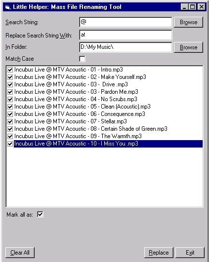



## Little Helper: Mass File Renamer

### Description

This application will allow users to rename files en-mass in a selected directory based on a search criteria. Files will be returned based on a search string, users can select which files to rename.

I use this for correcting MP3 file names that i download (remove underscores, correct capitalization etc)

(I used the "Little Helper: Auto Insert Error Trapping / COmments" to insert error handling into this code :) find it on this site! )
 
### More Info
 

             |
---                |---
**Submitted On**   |2001-01-08 12:00:26
**By**             |[Charlie Kirkwood](https://github.com/Planet-Source-Code/PSCIndex/blob/master/ByAuthor/charlie-kirkwood.md)
**Level**          |Advanced
**User Rating**    |3.3 (10 globes from 3 users)
**Compatibility**  |VB 6\.0
**Category**       |[Complete Applications](https://github.com/Planet-Source-Code/PSCIndex/blob/master/ByCategory/complete-applications__1-27.md)
**World**          |[Visual Basic](https://github.com/Planet-Source-Code/PSCIndex/blob/master/ByWorld/visual-basic.md)
**Archive File**   |[CODE\_UPLOAD13541182001\.zip](https://github.com/Planet-Source-Code/charlie-kirkwood-little-helper-mass-file-renamer__1-14248/archive/master.zip)

### API Declarations

see code

